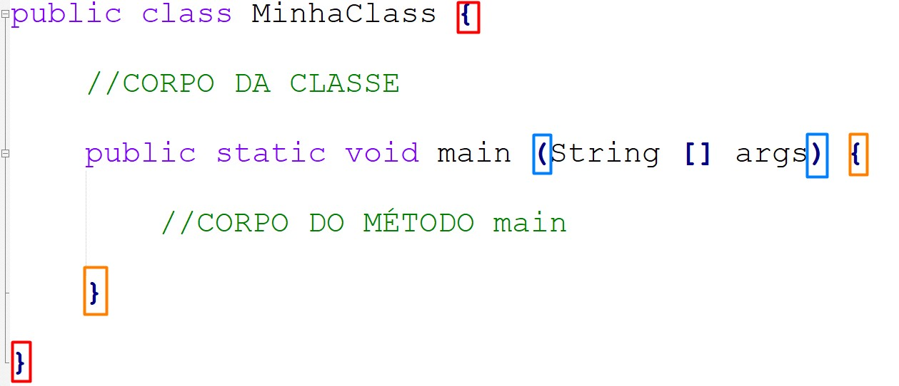

Para verificar se o Java está instalado no pc, digitar na busca CMD e clicar em prompt de comando. Digitar "JAVAC" ou "JAVA -VERSION".

JVM é a máquina virtual do java
JDK é java development kit

Baixar jdk no site da Oracle, de acordo com o sistema operacional (86x ou x64) > https://www.oracle.com/br/java/technologies/downloads/#java8-windows <

 -Jdk para desenvolvimento, que já inclui o JRE
 -JRE somente para rodar o programa em java

 É preciso configurar as variáveis de ambiente no PATH

# Instalação Java 

1. Instalar como administrador
2. Colocar o java no path
    botão direito no "este computador" 
    propriedades 
    configurações avaçadas do sistema
    avançado
    variáveis de ambiente
    nas variáveis do sistema > novo > JAVA_HOME > valor da variável é o texto do caminho da pasta onde foi instalado o JDK > ok

3. localizar nas variáveis dos sistema o path
4. clicar nele > adicionar > %JAVA_HOME%\bin

# Instalação de IDE 

A IDE é a plataforma de desenvolvimento parecida com o Vscode. No java usa-se Eclipse ou IntelliJ.


https://www.youtube.com/watch?si=H6-j_plL6OlMKz3Z&v=m60Qe5dLQKI&feature=youtu.be


# Convenções

Combinações/Padrões 

Design patterns = Padrões de Projeto

GOF = Gang of four

- nome do projeto deve seguir o padrão: 
```ex:
com.itau.sistema.financeiro 
```

- nome do arquivo (dentro do projeto)
```ex:
MeuArquivo.java
```

- classes
    as primeiras letras maiúscula em cada palavra


- funções
    tem parênteses vazio 

- métodos
    tem parênteses com parâmetros

- variáveis
    primeira letra da primeira palavra minuscula e a primeira letra das demais palavras maiuscula - "camelCase".
    Nomes que declaram a função da variável, auto explicativo.


# Algorítmo

A capacidade humana de fazer o computador seguir ordens na sequência demandada.

